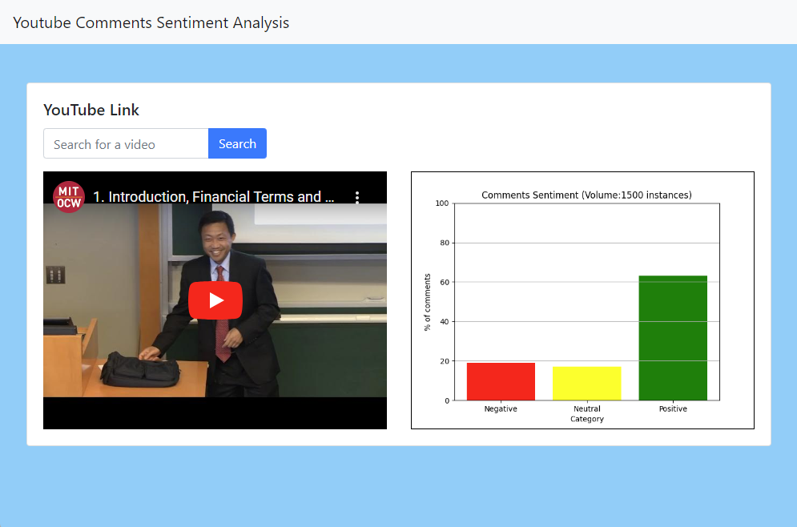
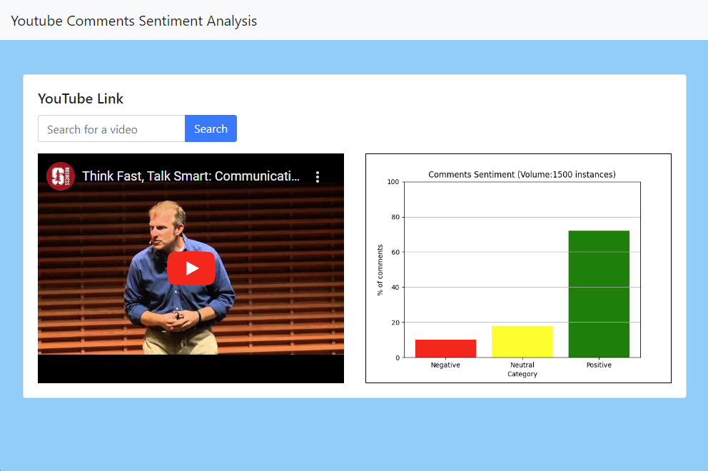
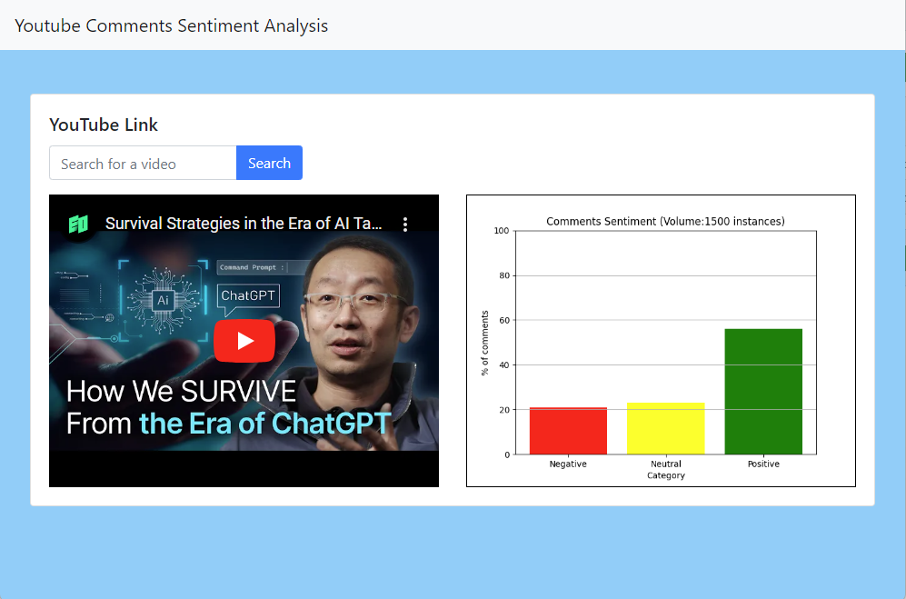

# YouTube NLP Comment Analysis

This repository contains the code and resources for analyzing YouTube comments using Natural Language Processing (NLP) techniques.

## Introduction

YouTube NLP Comment Analysis is a project that aims to extract sentiment and gain valuable insights into the overall perception and sentiment of viewers towards specific videos. By utilizing NLP techniques, we can analyze user-generated comments on YouTube and understand the sentiment expressed by viewers.

## Features

- Collect YouTube comments using the web scraping techniques.
- Preprocess comments by removing noise, such as special characters, URLs, and excessive punctuation.
- Perform sentiment analysis using lexicon-based methods or machine learning algorithms.
- Visualize sentiment patterns using bar charts

## Installation

1. Clone the repository:

   ```bash
   git clone https://github.com/jpkrajewski/youtube-nlp-comment-analysis.git
   ```

2. Run Docker-Compose

   ```bash
   cd youtube-nlp-comment-analysis; docker compose up --build
   ```

3. Go to **localhost:8000**

## Results
The project generates visualizations and reports that provide insights into the sentiment patterns of YouTube comments. These include:

Bar charts showing sentiment distribution, categorizing comments as negative, neutral, or positive.





